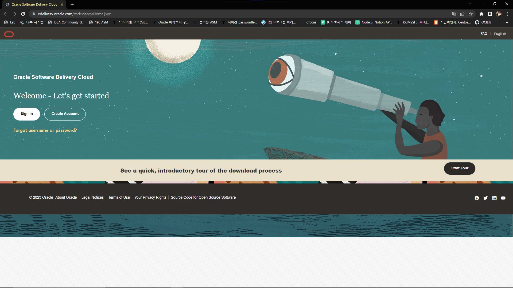
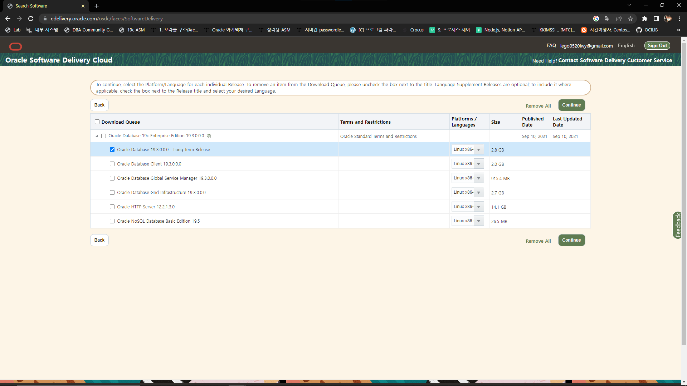

# FS Single-Tenancy 19c in CentOS 7

## Download

<figure><figcaption></figcaption></figure>

<figure><figcaption></figcaption></figure>

<figure><figcaption></figcaption></figure>

## Preliminary

### Install Dependent Libraries

```bash
yum -y install compat-libstdc++-33.x86_64 binutils elfutils-libelf elfutils-libelf-devel
yum -y install glibc glibc-common glibc-devel glibc-headers gcc gcc-c++ libaio libaio-devel
yum -y install libgcc libstdc++ libstdc++-devel make sysstat unixODBC unixODBC-devel
yum -y install unzip wget ksh
yum -y install https://yum.oracle.com/repo/OracleLinux/OL7/latest/x86_64/getPackage/oracle-database-preinstall-19c-1.0-3.el7.x86_64.rpm
```

위 preinstall을 설치할 경우 계정과 그룹, System 변수 값들을 설정해준다.

### Set Environment Variables

```bash
vi ~oracle/.bash_profile

# vi ~/.bash_profile st #
export TMP=/tmp
export TMPDIR=$TMP
export ORACLE_BASE=<oracle_base_path>   # ex) /app/oracle
export ORACLE_HOME=<oracle_home_path>   # ex) $ORACLE_BASE/product/19.3.0.0.0/dbhome_1
export ORACLE_SID=<oracle_sid>          # ex) orcl
export NLS_LANG=<nls_lang>              # ex) AMERICAN_AMERICA.AL32UTF8
export TNS_ADMIN=$ORACLE_HOME/network/admin
export ORACLE_HOSTNAME=<hostname>       # ex) localhost
export LD_LIBRARY_PATH=$ORACLE_HOME/lib:$LD_LIBRARY_PATH
export PATH=$ORACLE_HOME/bin:$PATH:$HOME/.local/bin:$HOME/bin
# vi ~/.bash_profile ed #
 
source ~/.bash_profile
 
# 확인 #
echo $ORACLE_HOME
```

### Create Directories

```bash
mkdir -p $ORACLE_HOME    # Directory 생성
chown -R oracle.dba /app    # Directory Owner User, Group 변경
```

## Install Database

```bash
mv <oracle_zip_file> $ORACLE_HOME # Oracle Home에 설치 파일을 옮김

cd $ORACLE_HOME

unzip <oracle_zip_file> # ex) unzip V982063-01.zip

./runInstaller
```

<figure><figcaption></figcaption></figure>

<figure><figcaption></figcaption></figure>

<figure><figcaption></figcaption></figure>

<figure><figcaption></figcaption></figure>

<figure><figcaption></figcaption></figure>

<figure><figcaption></figcaption></figure>

<figure><figcaption></figcaption></figure>

<figure><figcaption></figcaption></figure>

<figure><figcaption></figcaption></figure>

<figure><figcaption></figcaption></figure>

<figure><figcaption></figcaption></figure>

<figure><figcaption></figcaption></figure>

<figure><figcaption></figcaption></figure>

<figure><figcaption></figcaption></figure>

<figure><figcaption></figcaption></figure>

<figure><figcaption></figcaption></figure>

<figure><figcaption></figcaption></figure>

<figure><figcaption></figcaption></figure>

<figure><figcaption></figcaption></figure>

<figure><figcaption></figcaption></figure>

## Check Oracle Database & Listener

```bash
sqlplus -version
sqlplus / as sysdba
```

```sql
shutdown immediate
startup
exit
```

```bash
lsnrctl start
lsnrctl status
```
