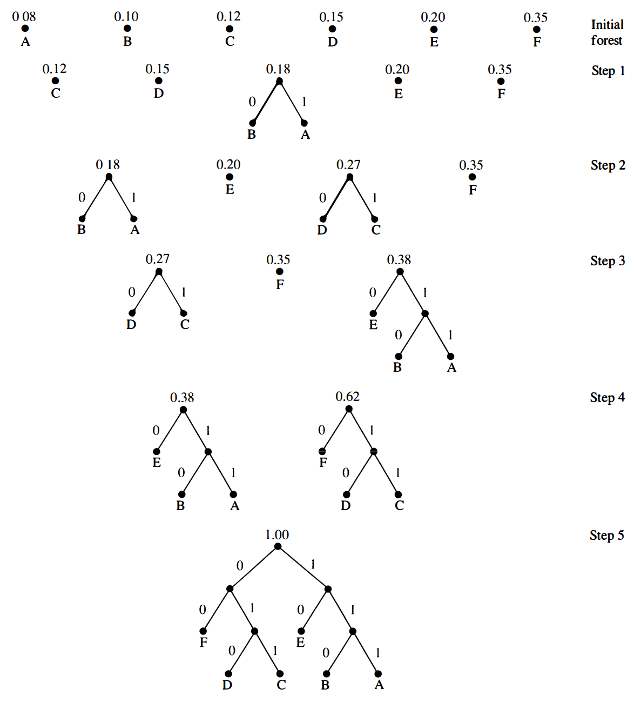
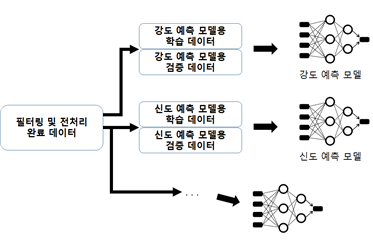
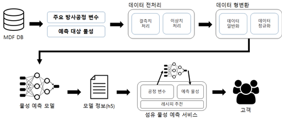
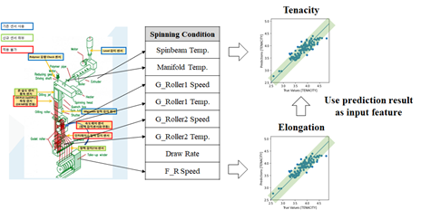
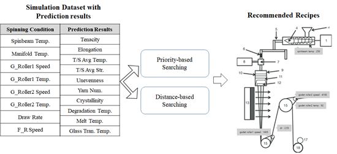

# 과제(다이텍)

## 연도별 핵심 내용 요약

### \`22

* **주제**: 섬유 염색 공정 데이터 기반의 내광성 등급 예측 모델 구축
* **주요 활동**
  * 염색 · 가공 공정 데이터 분석 및 AI 모델 개발
  * 염료 조합과 투입량, 공정 온도 등 데이터를 분석하여 내광성 예측
  * 데이터 전처리 (MinMax Scaler 적용, 이상치 처리 등)
  * Random Forest, Multi-Layer Perceptron 모델 활용 및 하이퍼 파라미터 튜닝
* **결과 및 이슈**
  * 데이터 불균형(특히 높은 내광성 등급 데이터 부족) 문제 존재
  * 내광성 예측 정확도 약 70.8% 수준​

### \`23

* **주제**: 고내광성 친환경 내장재 개발을 위한 내광성 등급 예측 모델 고도화
* **주요 활동**
  * 데이터 추가 수집(총 4773건), 특징 데이터 70종 분석
  * 내광성 등급 예측 정확도 개선 (약 84.6%)
  * AutoML 활용한 모델 성능 향상, 이상치 처리(변퇴색 계산 기반의 기법 적용)
* **결과 및 이슈**
  * 데이터 증가로 예측 정확도가 높아졌으나 여전히 높은 등급 데이터 부족 문제 있음
  * 염료와 배합제의 상관관계 분석 결과 변화 관찰​

### '24

* **주제**: 섬유 신소재 및 복합구조체 개발 지원을 위한 AI 기반 가상 검증 플랫폼 구축
* **주요 활동**
  * 내광성 예측 모델의 추가적인 성능 고도화(데이터 총 6879건)
  * 회귀(Regression) 모델 적용(autoML Blending: Random Forest, ExtraTrees, XGBoost)
  * 정확도 향상 (약 90.4%)
* **결과 및 이슈**
  * 데이터셋의 다양성 확보(일광증진제 포함 여부, 콤비/단색 데이터 분류)
  * 정확도는 지속적으로 향상됐으며 데이터 관리와 전처리 프로세스 자동화됨​

***

## Keyword

### AI 및 데이터 분석 관련

* **AI 모델링 및 기계 학습**
  * Classification(분류), Regression(회귀)
  * Random Forest, Multi-Layer Perceptron(MLP), ExtraTrees, XGBoost
  * AutoML(Automated Machine Learning)
* **데이터 전처리**
  * Min-Max Scaling, 정규화(Normalization)
  * 결측값 처리, 이상치 탐지 및 처리 (LOF, IQR, Z-score)
* **데이터 분석 도구**
  * Python (pandas, numpy, sklearn), R (dplyr, corrplot)
  * Google Colaboratory 환경 활용

### 섬유 공학 및 내광성 관련

* 염료 배합 및 염색 공정 (전처리, 배합, 염색, 후처리, 후가공)
* 섬유 내광성 시험 기준 및 평가 방법(&#x4C;_&#x61;_&#x62;\* 색공간, 내광성 등급 기준)
* 일광증진제 및 섬유 표면 처리 기술

### 관련 서적 및 자료

#### Machine Learning

<figure><figcaption>
Hands-On Machine Learing with Scikit-Learn, Keras &#x26; TensorFlow
</figcaption></figure>

* 『핸즈온 머신러닝』 - 오렐리앙 제롱
  * 머신러닝과 딥러닝의 기초부터 고급까지 폭넓게 다룸

<figure><figcaption>
Introduction to Machine Learning with Python
</figcaption></figure>

* 『파이썬 라이브러리를 활용한 머신러닝』 - 안드레아스 뮐러, 사라 가이도
  * scikit-learn 활용 데이터 분석 및 모델링 실습

#### Data Analysis

<figure><figcaption>
Python for Data Analysis
</figcaption></figure>

* 『파이썬 데이터 분석 입문』 - 웨스 맥키니
  * pandas를 활용한 데이터 전처리 및 분석 실습

<figure><figcaption></figcaption></figure>

* 『R을 이용한 데이터 처리 & 분석 실무』 - 해들리 위컴
  * R언어를 활용한 데이터 처리 실습서

***

## '22

### Project 2

Project 2는 생활용, 산업용 생분해성 섬유 개발을 위한 AI Platform을 구축하는 프로젝트이다.

## '23

Project 2 AI Model 구축

* 효율적인 생분해성 섬유 방사공정 수집 데이터 처리를 위한 구조 확립
  * 엑셀 데이터 활용 방식에서 데이터베이스 활용 방식으로 변경
  * 데이터 종류별 테이블 구성으로 필요 공정 변수 데이터 및 물성 데이터 추출
  * 데이터베이스 사용으로 추가/변경/제거에 대한 유연한 대응

&#x20;

* 인장강도 및 인장신도 외 물성 예측 모델 추가 개발
  * 주요 물성 외 8개 물성에 대한 예측 모델 개발
  * 성능 최적화 및 비교를 통한 물성별 최적 예측 모델 탐색

&#x20;

* 효율적인 데이터 처리로 물성 예측 모델 유효성 검증 및 모델 완성도 향상
  * 불균형 데이터 보완에 따른 모델 성능 개선도 검증
  * 머신러닝, 딥러닝 모델 구성 및 하이퍼 파라미터에 따른 성능 비교 검증
  * 모델 유효성 검증 최소 85% 수준 확보(목표치 80%)

&#x20;

* 효과적인 모델 검증을 위한 별도의 테스트 데이터 생성
  * 수집하지 못한 영역의 물성 예측 시뮬레이션을 위한 주요 방사공정 변수들의 사용 가능 범위에서 테스트 데이터 생성 및 시뮬레이션 테스트
  * 물성별 범위에 OFFSET을 적용하여 가능한 모든 경우의 수에 대한 시뮬레이션 데이터 생성

&#x20;

* 생분해성 섬유(PLA) 고강도 레시피 탐색
  * 여러 모델들의 시뮬레이션 테스트 결과 비교로 고강도 레시피 탐색
  * 추출한 고강도 레시피들의 실제 방사 및 물성 분석 결과 검증 예정

Project 2 과제 목표

* 데이터 처리부터 섬유 물성 예측 모델 서비스 제공까지의 자동화
  * 방사 공정 데이터의 축적에 따른 모델 업데이트
  * 입력 데이터 처리 간소화에 따른 데이터 필터링과 전처리의 자동화
  * 물성 예측 모델들의 학습 및 검증 프로세스 자동화
  * 물성 예측 모델들의 업데이트 자동화

&#x20;

* 생분해성 섬유 10개 물성들의 우선순위 및 허용오차 확립
  * 섬유의 물성 중요도에 따른 우선순위 정의
  * 물성별 이상치 처리 및 유효성 검증을 위한 허용오차 정의

&#x20;

* 생분해성 섬유 물성 예측 모델 개선 및 성능 검증
  * 물성 예측 모델 일반화로 인한 고강도 예측 문제 개선
  * 다른 물성 예측치를 활용한 물성 예측 성능 개선
  * 물성별 예측 모델 목표 성능(유효성 검증 90% 이상) 달성

&#x20;

* 시뮬레이션 기반 역설계 모델을 통한 방사 공정 레시피 추천 서비스 개발
  * 물성별 입력값에 따른 주요 방사 공정 변수들의 레시피 추천
  * 시뮬레이션 데이터 및 물성별 예측값을 활용한 유사한 데이터 레시피 추천

&#x20;

* 공인 시험을 통한 생분해성 섬유 물성 예측 모델 기능 및 성능 검증
  * 다양한 공인 시험 중 개발된 모델의 성능을 검증하는데 적합한 시험을 진행

Project 2 수행 내용 및 범위

* 방사 공정 데이터의 축적에 따른 모델 업데이트&#x20;
  * 생분해성 섬유 공정 데이터의 처리는 방사 공정 데이터셋이 축적됨에 따라\
    물성 예측 모델에 추가 데이터의 적용이 이루어져야 함
  * 추가된 데이터는 이상치 제거와 같은 전처리뿐만 아니라 모델의 학습 및 검증에도 영향

&#x20;

<figure><figcaption></figcaption></figure>

* 입력 데이터 처리 간소화에 따른 데이터 필터링과 전처리의 자동화
  * 방사 공정 변수와 물성 변수 데이터의 분리
  * 필요에 따라 데이터 정규화 적용 및 관리
  * 허용오차 및 이상치 처리 알고리즘을 적용한 데이터 이상치 제거
  * 물성 우선순위 또는 특정 물성 기준으로 정렬된 데이터 관리

&#x20;

* 물성 예측 모델들의 학습 및 검증 프로세스 자동화
  * 전처리된 데이터로부터 물성별 예측 모델 학습과 검증용 데이터 자동 추출
  * AutoML의 모델 비교 기능 등을 활용하여 모델 학습 검증 반복 비교를 통해\
    물성별 최적 모델 선택

&#x20;

<figure><figcaption></figcaption></figure>

* 프로세스 자동화를 통한 생분해성 섬유 물성 예측 서비스 구현
  * 데이터 필터링, 전처리, 모델 학습 및 검증 과정을 거쳐 선택한 최종 모델의\
    업데이트 수행
  * 업데이트 된 물성 예측 모델들로 시뮬레이션 데이터들의 업데이트 수행\
    ( 섬유 물성 예측 서비스 최신화 )

&#x20;

<figure><figcaption></figcaption></figure>

* 생분해성 섬유 10개 물성들의 우선순위 및 허용오차 확립
  * 섬유 물성 예측 서비스 제공 시 물성들 중 상대적으로 중요한 인장강신도와 기타 물성들에 차별성을 두기 위한 우선순위 규칙 정의 및 적용
  * 물성별 모델의 최적 학습 및 검증용 양질의 데이터를 위한 이상치 처리와\
    회귀 모델의 유효성 검증 척도로 사용하기 위한 물성별 적절한 허용오차 정의

&#x20;

* 생분해성 섬유 물성 예측 모델 개선 및 성능 검증
  * 예측 오류 최소화 기준 모델 개선으로 인한 예측치 일반화 완화를 위해 복잡성을 고려한 다양한 모델들의 앙상블 활용
  * 미수집 구간의 방사공정 데이터셋에 대한 모델들의 예측치들과 실제 방사\
    테스트 및 물성 분석 결과를 비교하여 검증
  * 특정 물성 예측 모델의 입력 데이터로 다른 물성 예측치를 활용하여 성능\
    개선(예시: 인장강도 예측 시 인장신도 예측치를 활용)
  * 물성별 예측 모델 목표 성능(유효성 검증 90% 이상) 달성

&#x20;

<figure><figcaption></figcaption></figure>

* 시뮬레이션 기반 역설계 모델을 통한 방사 공정 레시피 추천 서비스 개발
  * 물성별 입력값에 따른 주요 방사 공정 변수들의 레시피 추천
  * 물성별 우선순위 또는 데이터 거리 기반 적절한 시뮬레이션 데이터셋 탐색

<figure><figcaption></figcaption></figure>

* 공인 시험을 통한 생분해성 섬유 물성 예측 모델 기능 및 성능 검증
  * 생분해성 섬유(PLA)의 공정 변수 데이터셋과 물성 데이터셋으로 개발한 모델들로 구현한 생분해성 섬유 물성 예측 소프트웨어의 공인 검증
  * 입력 정보, 결과 정보, 내부 동작 및 성능에 대한 상세한 스펙 정보 작성
  * 소프트웨어의 사용법과 구체적인 동작, 성능에 대한 검증 방법과 결과에 대한 것을 공인 시험검증연구소에 의뢰하여 인증
  * 공인 인증서를 통해 개발된 생분해성 섬유 물성 예측 소프트웨어에 대한 신뢰성 확보

## \`24

