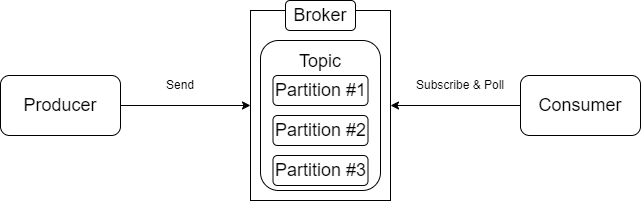
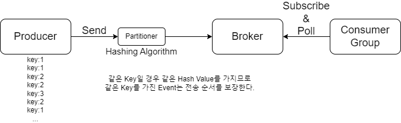

# Kafka

## Kafka Architecture

<figure><figcaption><p>카프카 구성도</p></figcaption></figure>

## Glossary of Terms <a href="#id-1.kafka-glossaryofterms" id="id-1.kafka-glossaryofterms"></a>

\


| Term                   | Description                                                                                                                                                                                                             |
| ---------------------- | ----------------------------------------------------------------------------------------------------------------------------------------------------------------------------------------------------------------------- |
| Kafka(Kafka Cluster)   | Apache Project Application으로 여러 대의 Broker를 구성한 Cluster이다.                                                                                                                                                               |
| Broker                 | Kafka Application이 설치된 Server나 Node를 의미한다.                                                                                                                                                                              |
| Event(Record, Message) | <p>Kafka에서 사용하는 데이터 단위이다.</p><p>구성 요소는 Topic, Partition, Key, Value, Header이다.</p><ul><li>이 중 필수 값은 Topic과 Value이다.</li></ul><p>양식은 보통 JSON, Avro, Protobuffer 등을 사용한다.</p><p>해당 데이터는 직렬화를 통해 Byte Array로 변환해 전송한다.</p> |
| Topic                  | Event가 쌓이는 논리적인 저장소이다.                                                                                                                                                                                                  |
| Producer               | Kafka에 Event를 게시(Publish)하는 Client Application이다.                                                                                                                                                                       |
| Consumer               | Kafka Topic을 구독(Subscribe)하여 읽은 Event를 처리하는 Client Application이다.                                                                                                                                                       |
| Partition              | <p>Topic은 Partition으로 구성되어 있다.</p><p>Partition 마다 Offset이 따로 관리된다.</p><p>Partition 내에서는 순서가 보장된다.</p><p>Event가 어떤 Partition에 저장되는 지는 보통 Key 값에 의해 결정된다.</p><p>같은 Key 값을 사용할 경우 같은 Partition에 저장된다.</p>                  |
| Segment                | <p>Producer가 전송한 Event의 실제 물리 파일이다.</p><p>Partition 마다 Segment가 분리되어 있다.</p>                                                                                                                                            |
| ZooKeeper              | <p>분산 시스템을 구성하기 위해 필요한 분산 합의와 데이터 복사 등의 과정을 효율적으로 처리하기 위해 사용되는 분산 조정 시스템이다.</p><p>Kafka의 Leader Node를 정하거나 Multi-Node Kafka Cluster에서 Disk 관리 등을 한다.</p>                                                                |
| Schema Registry        | <p>Confluent Kafka에서 개발한 Web Application이다.</p><p>Kafka Client 사이에서 Event의 Schema를 저장하고 관리한다. </p>                                                                                                                      |

## Topic <a href="#id-1.kafka-topic" id="id-1.kafka-topic"></a>

* Event를 보내면 Topic에 저장된다.
* Topic은 여러 개의 Partition으로 구성된다.
* Topic은 RDBMS의 Partitioned Stored Table과 유사하다.
* Topic명은 영문자, 마침표, 언더바, 하이픈만 사용 가능하다.(A\~Z, a\~z, 0\~9, ., \_, -)
* Topic은 시간에 흐름에 따라 이벤트가 순차적으로 물리적인 파일에 작성된다.
  * 해당 물리 파일은 Segment라고 부른다.
  * 해당 물리 파일은 log, index, timeindex로 구성된다.
    * log에는 데이터가 Append 되며 쌓인다.
    * index에는 특정 크기마다 해당하는 Offset을 저장한다.
    * timeindex는 위 index를 기록할 때의 시간을 기록한다.
  * Update나 Delete가 불가하고 Insert 된 데이터들은 Append한다.
* Partition에 들어오는 Event는 Key - Value Based Message Structure이며 Value로는 어떤 타입도 가능하다.
* 개별 Partition은 완전히 독립적이며 개별 Partition 내에서 정렬되고 따로 Offset을 할당한다.
* Topic과 Partition의 병렬 분산 처리는 아래와 같다.
  * Topic 내의 개별 Partition들에 Event는 분산 저장된다.
  * Topic의 Partition들은 단일 Kafka Broker 뿐만 아니라 여러 개의 Kafka Broker에 분산 처리된다.
  * 분산된 Topic은 어떠한 Partition은 다른 Broker에 존재할 수 있으며 다른 Broker가 내려갈 경우 Replication Factor를 설정해주지 않았다면 Event의 일부를 잃게 된다.
  * Replication Factor를 설정했을 경우 이벤트가 수 만큼 복제되어 HA 구성이 가능해진다.
    * Replication Factor 설정 만큼 Event를 중복해서 각 Broker에 저장하는 것이기에 저장 공간이 Replication Factor 수만큼 배로 사용된다.
    * Replication Factor 설정 시 Leader와 Follower로 나뉘며 Leader를 가지고 있는 Server가 죽을 경우 Follower가 Reader가 된다.
      * 이후 ISR에서 추가 기술

<figure><figcaption><p>간략한 카프카 구성도</p></figcaption></figure>

### Topic 생성 및 정보 확인 <a href="#id-1.kafka-topic" id="id-1.kafka-topic"></a>

* $CONFLUENT\_HOME/bin/kafka-topics Command를 이용한다.
* 설정 파일의 경우 $CONFLUENT\_HOME/etc/kafka/server.properties이다.

| Parameter          | Description                                                                                                                                                                                                                                                                                                                                                                                                                               |
| ------------------ | ----------------------------------------------------------------------------------------------------------------------------------------------------------------------------------------------------------------------------------------------------------------------------------------------------------------------------------------------------------------------------------------------------------------------------------------- |
| --bootstrap-server | <ul><li>Topic을 생성할 Kafka Broker의 Server 주소와 Port 번호이다.</li></ul><table data-header-hidden><thead><tr><th></th></tr></thead><tbody><tr><td><code>--bootstrap-server &#x3C;server>:&#x3C;port></code></td></tr></tbody></table>                                                                                                                                                                                                             |
| --create           | <ul><li>--topic: 해당 Topic 명으로 신규 Topic을 생성한다.</li><li>--partitions: Topic의 Partition의 개수이다.</li><li>--replication-factor: Replication의 개수이다(Multi-Node Kafka Cluster).</li></ul><table data-header-hidden><thead><tr><th></th></tr></thead><tbody><tr><td><code>--bootstrap-server &#x3C;server>:&#x3C;port> --create --topic &#x3C;topic> --partitions &#x3C;number> --replication-factor &#x3C;number></code></td></tr></tbody></table> |
| --list             | <ul><li>Broker에 있는 Topic 리스트를 확인한다.</li></ul><table data-header-hidden><thead><tr><th></th></tr></thead><tbody><tr><td><code>--bootstrap-server &#x3C;server>:&#x3C;port> --list</code></td></tr></tbody></table>                                                                                                                                                                                                                         |
| --describe         | <ul><li>--topic: 기술된 Topic 명으로 상세 정보를 표시한다.</li></ul><table data-header-hidden><thead><tr><th></th></tr></thead><tbody><tr><td><code>--bootstrap-server &#x3C;server>:&#x3C;port> --describe --describe &#x3C;topic></code></td></tr></tbody></table>                                                                                                                                                                                     |
| --delete           | <ul><li>--topic: 기술된 Topic을 삭제한다.</li></ul><table data-header-hidden><thead><tr><th></th></tr></thead><tbody><tr><td><code>--bootstrap-server &#x3C;server>:&#x3C;port> --delete --topic &#x3C;topic></code></td></tr></tbody></table>                                                                                                                                                                                                    |

## Event의 Partition 할당 전략 <a href="#id-1.kafka-event-partition" id="id-1.kafka-event-partition"></a>

* Event는 Topic, Partition, Key, Value, Header 값을 가진다.
* 위 값중 Topic과 Value만 필수 값이며 나머지는 없을 수 있다.
* Partition에 할당할 때 보통 Key 값을 해싱하여 해당 값을 Mod 연산을 통해 분배하여 할당한다.
* Key 값이 없을 경우에는 성능 측면을 고려하기 위해 다양한 전략을 사용하여 Partition 별로 분배해 할당한다.
* 각 Partition 내에서만 순서가 보장되기에 중요하다.
  * RDBMS에 데이터를 전송해 주는 CDC의 용도로 사용을 생각해 보면 아래와 같다.
    * 각 키 값 마다 Partition을 나눴을 때 해당 Partition에는 같은 Key들의 집합이 순서대로 모이게 된다.
    * Kafka는 기본적으로 멱등성을 보장해줘야 하기에 Delete와 Upsert로만 처리를 한다.
    * **위 예시는 조금 더 고민 후 수정 예정**

### Key 값을 가지지 않는 Event 전송 <a href="#id-1.kafka-key-event" id="id-1.kafka-key-event"></a>

* Event는 Producer를 통해 전송 시 Partitioner를 통해 Topic의 어떤 Partition으로 전송되어야 할 지 미리 결정된다.
* Key 값을 가지지 않는 경우 Round Robin, Sticky Partition 등의 Partition 전략 등이 선택되어 Partition 별로 Message가 전송될 수 있다.

<figure><figcaption><p>Key가 없는 Event 예시</p></figcaption></figure>

### Key 값을 가지는 Event 전송 <a href="#id-1.kafka-key-event" id="id-1.kafka-key-event"></a>

* Event Key 값은 Event Produce / Consume 시 분산 성능 영향을 고려하여 생성한다.

<figure><figcaption><p>Key가 있는 Event 예시</p></figcaption></figure>

## Kafka Config <a href="#id-1.kafka-kafkaconfig" id="id-1.kafka-kafkaconfig"></a>

### Kafka Config의 구분과 이해 <a href="#id-1.kafka-kafkaconfig" id="id-1.kafka-kafkaconfig"></a>

| Config                           | Description                                                                                                                                                                                                                                                                                                   |
| -------------------------------- | ------------------------------------------------------------------------------------------------------------------------------------------------------------------------------------------------------------------------------------------------------------------------------------------------------------- |
| Broker & Topic Level Config      | <p>Kafka Server에 설정되는 Config이다.</p><p>Topic의 Config 값은 Broker Level에서 지정한 Config를 기본으로 설정한다.</p><ul><li>별도의 Topic Level Config를 설정할 경우 별도 Config를 따른다.</li></ul><p>보통 server.properties에 있는 Config는 변경 시 Broker 재기동이 필요한 Static Config이다.</p><p>Dynamic Config는 kafka-configs를 이용하여 동적으로 Config 변경이 가능하다.</p> |
| Producer & Consumer Level Config | <p>Kafka Client에서 설정되는Config이다.</p><p>Client Level에서 설정되므로 kafka-configs로 수정할 수 없으며 Client 수행 시마다 설정 가능하다.</p>                                                                                                                                                                                                |

### Kafka Config의 사용 방법 <a href="#id-1.kafka-kafkaconfig" id="id-1.kafka-kafkaconfig"></a>

| Assortment     | Usage                                                                                                                                                                                                                                                                                                                     |
| -------------- | ------------------------------------------------------------------------------------------------------------------------------------------------------------------------------------------------------------------------------------------------------------------------------------------------------------------------- |
| Config 값 확인    | <table data-header-hidden><thead><tr><th></th></tr></thead><tbody><tr><td><code>kafka-configs --bootstrap-server &#x3C;host>:&#x3C;port> --entity-type</code> <code>[brokers | topics] --entity-name [&#x3C;broker_id> | &#x3C;topic>] --all --describe</code></td></tr></tbody></table>                                  |
| Config 값 설정    | <table data-header-hidden><thead><tr><th></th></tr></thead><tbody><tr><td><code>kafka-configs --bootstrap-server &#x3C;host>:&#x3C;port> --entity-type</code> <code>[brokers | topics] --entity-name [&#x3C;broker_id> | &#x3C;topic>] --alter --add-config &#x3C;property>=&#x3C;value></code></td></tr></tbody></table> |
| Config 값 설정 해제 | <table data-header-hidden><thead><tr><th></th></tr></thead><tbody><tr><td><code>kafka-configs --bootstrap-server &#x3C;host>:&#x3C;port> --entity-type</code> <code>[brokers | topics] --entity-name [&#x3C;broker_id> | &#x3C;topic>] --alter --delete-config &#x3C;property></code></td></tr></tbody></table>           |

## Quick Start

### Kafka 다운로드 <a href="#kafkaquickstart-kafka" id="kafkaquickstart-kafka"></a>

[Download](https://www.apache.org/dyn/closer.cgi?path=/kafka/3.4.0/kafka\_2.13-3.4.0.tgz) 링크를 눌러 파일을 다운한다.

```bash
tar -xzf kafka_2.13-3.4.0.tgzcd kafka_2.13-3.4.0
cd kafka_2.13-3.4.0
```

### Kafka Environment 시작

Apache Kafka는 ZooKeeper나 KRaft를 사용해 시작할 수 있다.

#### ZooKeeper 사용

```bash
bin/zookeeper-server-start.sh config/zookeeper.properties
bin/kafka-server-start.sh config/server.properties
```

#### KRaft 사용

```bash
KAFKA_CLUSTER_ID="$(bin/kafka-storage.sh random-uuid)"
bin/kafka-storage/sh format -t $KAFKA_CLUSTER_ID -c config/kraft/server.properties
bin/kafka-server-start.sh config/kraft/server.properties
```

### Topic 생성

```bash
bin/kafka-topics.sh --create --topic testing --bootstrap-server localhost:9092
bin/kafka-topics.sh --describe --topic testing --bootstrap-server localhost:9092
```

### Topic에 Event 생성

```bash
bin/kafka-console-producer.sh --topic testing --bootstrap-server localhost:9092
```

### Event 읽기

```bash
bin/kafka-console-consumer.sh --topic testing --from-beginning --bootstrap-server localhost:9092
```
