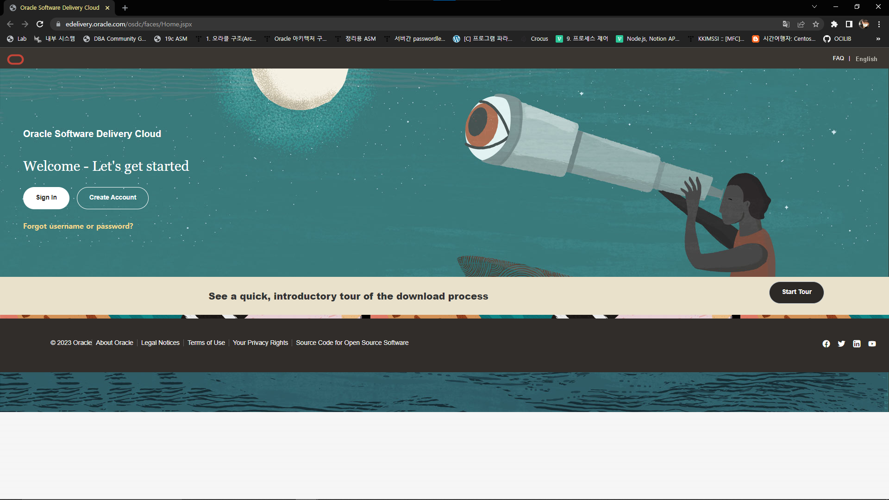

# 11gR2 in CentOS 7

## SDownload

<figure><figcaption><p><a href="https://edelivery.oracle.com/">Oracle EDelivery</a></p></figcaption></figure>

<figure><figcaption><p>Search Oracle Database 11g</p></figcaption></figure>

<figure><figcaption><p>Choose One</p></figcaption></figure>

## Preliminary

### Create User & Group

```bash
groupadd dba    # dba group 생성
useradd -g dba oracle   # dba group의 User oracle 생성
passwd oracle   # User oracle의 Password 설정
```

### Install Dependent Libraries

```bash
yum -y install compat-libstdc++-33.x86_64 binutils elfutils-libelf elfutils-libelf-devel
yum -y install glibc glibc-common glibc-devel glibc-headers gcc gcc-c++ libaio libaio-devel
yum -y install libgcc libstdc++ libstdc++-devel make sysstat unixODBC unixODBC-devel
yum -y install unzip wget
wget ftp://ftp.pbone.net/mirror/archive.download.redhat.com/pub/redhat/linux/7.0/en/os/i386/RedHat/RPMS/pdksh-5.2.14-8.i386.rpm
rpm -Uvh --nodeps pdksh-5.2.14-8.i386.rpm --force
```

### Set OS Kernel Parameter

```bash
vi /etc/sysctl.conf
​
# vi /etc/sysctl.conf st #
# Controls the maximum shared segment size, in bytes
kernel.shmmax = 68719476736
​
# Controls the maximum number of shared memory segments, in pages
kernel.shmall = 10523004
kernel.shmmni = 4096
kernel.sem = 250 32000 100 128
​
fs.aio-max-nr = 1048576
fs.file-max = 6815744
​
net.ipv4.ip_local_port_range = 9000 65500
​
net.core.rmem_default = 262144
net.core.rmem_max = 4194304
net.core.wmem_default = 262144
net.core.wmem_max = 1048586
# vi /etc/sysctl.conf ed #
​
/sbin/sysctl -p     # 적용
```

### Set Resource Limit

```bash
vi /etc/security/limits.conf
​
# vi /etc/security/limits.conf st #
oracle soft nproc 2048
oracle hard nproc 65536
oracle soft nofile 1024
oracle hard nofile 65536
# vi /etc/security/limits.conf ed #
```

### Disable SELINUX

```bash
vi /etc/selinux/config
# vi /etc/selinux/config st #
SELINUX=disabled
# vi /etc/selinux/config ed #
```

### Set Envrionment Variable

```bash
vi ~oracle/.bash_profile
​
# vi ~oracle/.bash_profile st #
export ORACLE_BASE=<oracle_base_path>   # ex) /app/oracle
export ORACLE_HOME=<oracle_home_path>   # ex) $ORACLE_BASE/product/11.2.0.1.0/dbhome_1
export ORACLE_SID=<oracle_sid>          # ex) orcl
export NLS_LANG=<nls_lang>              # ex) AMERICAN_AMERICA.AL32UTF8
export LD_LIBRARY_PATH=$ORACLE_HOME/lib:$LD_LIBRARY_PATH
export PATH=$ORACLE_HOME/bin:$PATH
# vi ~oracle/.bash_profile ed #
```

### Set Swap Memory(충분할 경우 무시)

Expected Value까지 Swap Memory 확보하는 것이 권장 사항이다.

```bash
free -h                 # Swap Memory 확인
​
dd if=<dev_path> of=<swap_file> bs=<bytes> count=<count>    # Swap Memory File 생성
                        # ex) dd if=/dev/zero of=/home/swapfile bs=1024 count=1000000   # 1GB의 Swap Memory File 생성
                 
mkswap <swap_file>      # File에 Swap Memory 영역 설정           # ex) mkswap /home/swapfile
​
swapon <swap_file>      # Swap Memory 활성화                   # ex) swapon /home/swapfile
chmod 664 <swap_file>   # ex) chmod 664 /home/swapfile
​
vi /etc/fstab
# vi /etc/fstab st #
<swap_file> swap    swap    defaults    1 1 # Swap Memory Rebooting 후에도 적용
                        # ex) /home/swapfile    swap    swap defaults   1 1
# vi /etc/fstab ed #
​
free -h                 # Swap Memory 확인
​
swapoff <swap_file>     # Swap Memory 비활성화                  # ex) swapoff /home/swapfile
rm -rf <swap_file>      # Swap Memory File 삭제               # ex) rm -rf /home/swapfile
```

### Create Directories

```bash
mkdir -p $ORACLE_HOME
chown -R oracle:dba /app
```

## Install Oracle Database

Oracle 계정으로 진행한다.

```bash
unzip <oracle_zip_file_1>   # ex) unzip V17530-01_1of2.zip
unzip <oracle_zip_file_2>   # ex) unzip V17530-01_2of2.zip

cd $ORACLE_HOME

./runInstaller
```

<figure><figcaption></figcaption></figure>

<figure><figcaption></figcaption></figure>

<figure><figcaption></figcaption></figure>

<figure><figcaption></figcaption></figure>

<figure><figcaption></figcaption></figure>

<figure><figcaption></figcaption></figure>

<figure><figcaption></figcaption></figure>

<figure><figcaption></figcaption></figure>

<figure><figcaption></figcaption></figure>

<figure><figcaption></figcaption></figure>

<figure><figcaption></figcaption></figure>

설치 중 발생한 에러를 방치한 채 새 세션으로 들어가 수정한다.

```bash
vi <error_mk_file>  # ex) vi /app/oracle/product/11.2.0.1.0/dbhome_1/ctx/lib/ins_ctx.mk
​
# vi <error_mk_file> st #
# ctxhx: $(CTXHXOBJ)
#   $(LINK_CTXHX) $(CTXHXOBJ) $(INSO_LINK) 부분을 아래와 같이 변경
ctxhx: $(CTXHXOBJ)
    -static $(LINK_CTXHX) $(CTXHXOBJ) $(INSO_LINK)
# vi <error_mk_file> st #
```

<figure><figcaption></figcaption></figure>

위와 마찬가지로 새 세션으로 들어가 수정한다.

```bash
vi <error_mk_file> # ex) vi /app/oracle/product/11.2.0.1.0/dbhome_1/sysman/lib/ins_emagent.mk
​
# vi <error_mk_file> st #
# $(SYSMANBIN) emdctl:
# $(MK_EMAGENT_NMECTL) 부분을 아래와 같이 변경
$(SYSMANBIN) emdctl:
$(MK_EMAGENT_NMECTL) -lnnz11
# vi <error_mk_file> st #
```

<figure><figcaption></figcaption></figure>

Root 계정으로 들어가 위 스크립트들을 실행시킨다.

```bash
<script1> # ex) /app/oraInventory/orainstRoot.sh
<script2> # ex) /app/oracle/product/11.2.0.1.0/dbhome_1/root.sh
# <script2> st #
[root@localhost ~]# /app/oracle/product/11.2.0.1.0/dbhome_1/root.sh
Running Oracle 11g root.sh script...
​
The following environment variables are set as:
   ORACLE_OWNER= oracle
   ORACLE_HOME= /app/oracle/product/11.2.0.1.0/dbhome_1
​
Enter the full pathname of the local bin directory: [/usr/local/bin]:<press_enter(Default)>
  Copying dbhome to /usr/local/bin ...
  Copying oraenv to /usr/local/bin ...
  Copying coraenv to /usr/local/bin ...
​
​
Creating /etc/oratab file...
Entries will be added to the /etc/oratab file as needed by
Database Configuration Assistant when a database is created
Finished running generic part of root.sh script.
Now product-specific root actions will be performed.
Finished product-specific root actions.
# <script2> ed #
```

## Create Listener

```bash
netca
```

<figure><figcaption></figcaption></figure>

<figure><figcaption></figcaption></figure>

<figure><figcaption></figcaption></figure>

<figure><figcaption></figcaption></figure>

<figure><figcaption></figcaption></figure>

<figure><figcaption></figcaption></figure>

<figure><figcaption></figcaption></figure>

## Create Database

```bash
dbca
```

<figure><figcaption></figcaption></figure>

<figure><figcaption></figcaption></figure>

<figure><figcaption></figcaption></figure>

<figure><figcaption></figcaption></figure>

<figure><figcaption></figcaption></figure>

<figure><figcaption></figcaption></figure>

<figure><figcaption></figcaption></figure>

<figure><figcaption></figcaption></figure>

<figure><figcaption></figcaption></figure>

<figure><figcaption></figcaption></figure>

<figure><figcaption></figcaption></figure>

<figure><figcaption></figcaption></figure>

<figure><figcaption></figcaption></figure>

<figure><figcaption></figcaption></figure>

<figure><figcaption></figcaption></figure>

<figure><figcaption></figcaption></figure>

<figure><figcaption></figcaption></figure>

<figure><figcaption></figcaption></figure>

## Check Oracle Database & Listener

```bash
sqlplus -version
sqlplus / as sysdba
```

```sql
shutdown immediate
startup
exit
```

```bash
lsnrctl start
lsnrctl status
```
